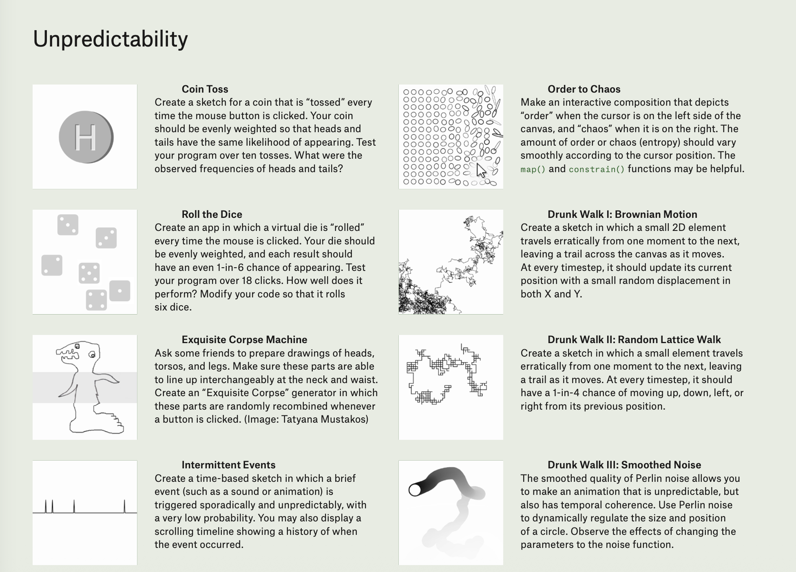

# Day 2: Randomness

## Topics
- `random()` function with one parameter
- `random()` function with two parameters (range)
- Generating random colors
- Generating random positions
- Generating random sizes
- Using `int()` to convert random floats to integers

---

## Activity: Unpredictability Project

Choose one of the following project prompts to explore randomness in Processing:

### Project Options
1. **Coin Toss** - Create a coin that's "tossed" every mouse click with equal odds for heads/tails
2. **Roll the Dice** - Create a virtual die (or six!) that rolls on mouse click
3. **Order to Chaos** - Interactive composition that shifts from order to chaos based on cursor position
4. **Drunk Walk I: Brownian Motion** - Element that travels erratically, leaving a trail
5. **Drunk Walk II: Random Lattice Walk** - Element with 1-in-4 chance of moving up/down/left/right
6. **Drunk Walk III: Smoothed Noise** - Use Perlin noise for smooth, unpredictable animation
7. **Exquisite Corpse Machine** - Randomly recombine drawings of heads, torsos, and legs
8. **Intermittent Events** - Time-based sketch with sporadic, unpredictable events

---

## Getting Started
Create a new sketch folder for your chosen project.

## Homework
- [Conditionals 2:02 - 2:28](https://www.youtube.com/watch?v=4JzDttgdILQ&t=7366s)
- Code: any sketch that uses random to create a visual effect
