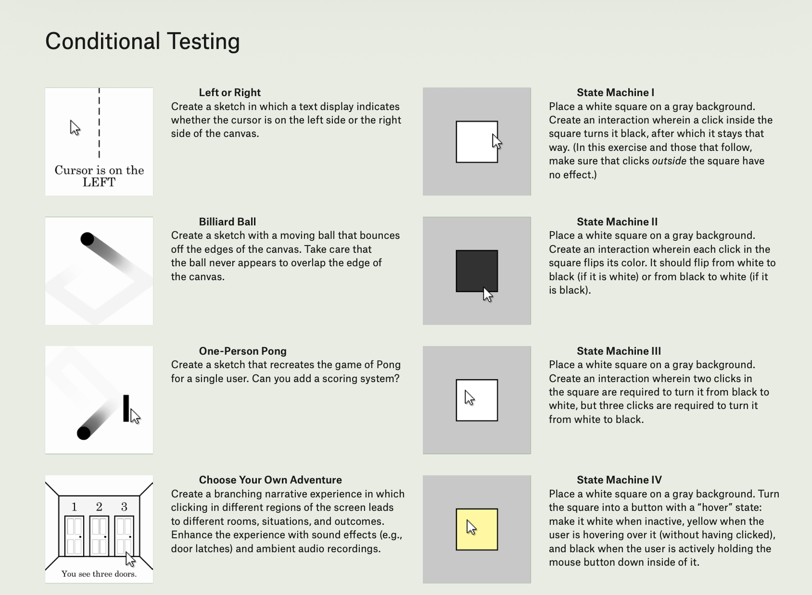

# Day 3: Boolean Variables and If Statements

## Topics
- Boolean data type (`true` / `false`)
- Declaring and using boolean variables
- `if` statement syntax and structure
- Comparison operators (`==`, `!=`, `<`, `>`, `<=`, `>=`)
- Using `keyPressed` with `if` statements
- Toggling boolean values

---

## Activity: Conditional Testing

Choose one of the following project prompts to explore conditionals in Processing:

### Project Options
1. **Left or Right** - Create a sketch where a text display indicates whether the cursor is on the left or right side of the canvas
2. **Billiard Ball** - Create a sketch with a moving ball that bounces off the edges of the canvas. Take care that the ball never appears to overlap the edge of the canvas
3. **One-Person Pong** - Create a sketch that recreates the game of Pong for a single user. Can you add a scoring system?
4. **Choose Your Own Adventure** - Create a branching narrative experience where clicking in different regions of the screen leads to different rooms, situations, and outcomes. Enhance the experience with sound effects and ambient audio recordings
5. **State Machine I** - Place a white square on a gray background. A click inside the square turns it black, after which it stays that way. Clicks outside the square have no effect
6. **State Machine II** - Place a white square on a gray background. Each click inside the square flips its color: white to black (if white) or black to white (if black)
7. **State Machine III** - Place a white square on a gray background. Two clicks in the square are required to turn it from white to black, but three clicks are required to turn it from black to white
8. **State Machine IV** - Place a white square on a gray background. Turn the square into a button with a "hover" state: white when inactive, yellow when the user is hovering over it (without having clicked), and black when the user is actively holding the mouse button down inside of it

---

## Getting Started
Create a new sketch folder for your chosen project.

## Homework
- [Conditionals 2:02 - 2:28](https://www.youtube.com/watch?v=4JzDttgdILQ&t=7366s)
- Code: A shape that disappears if clicked
