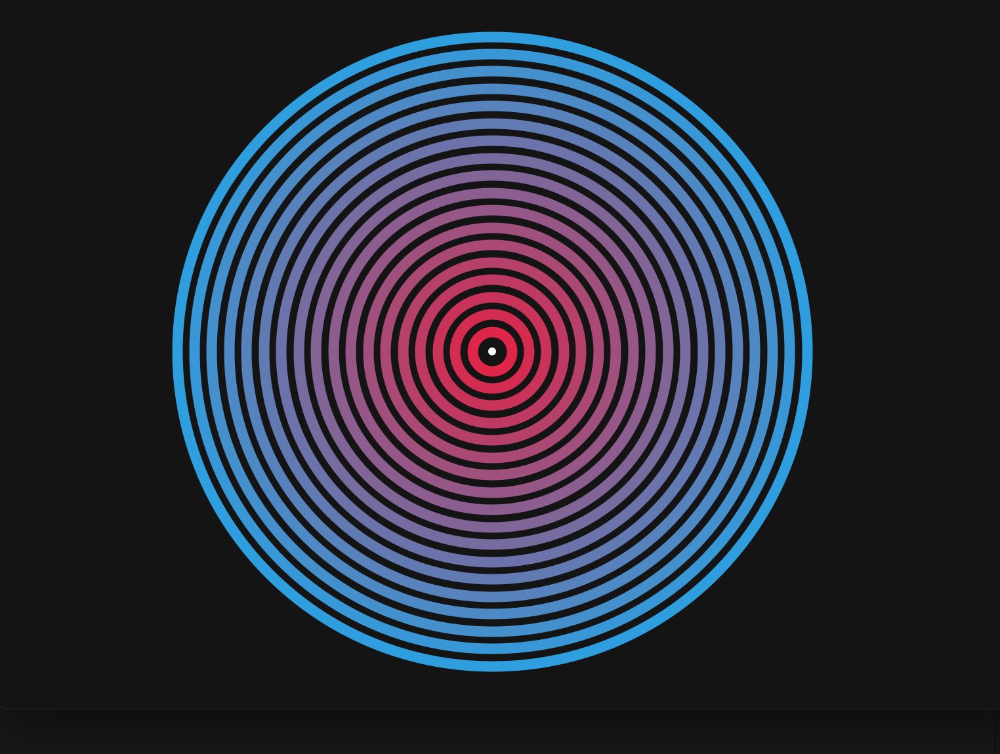
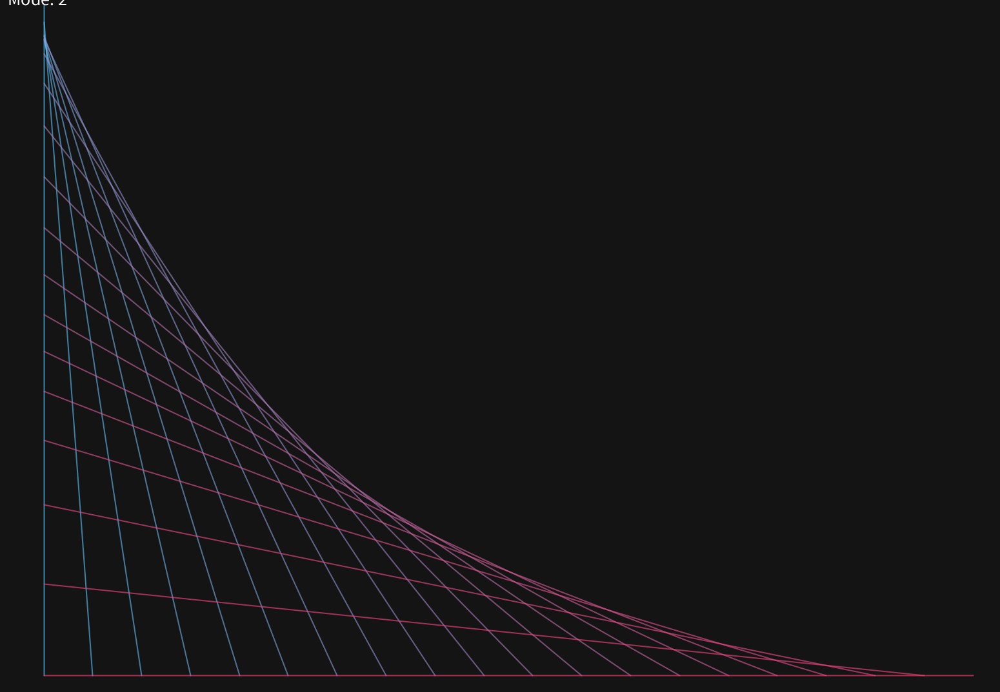
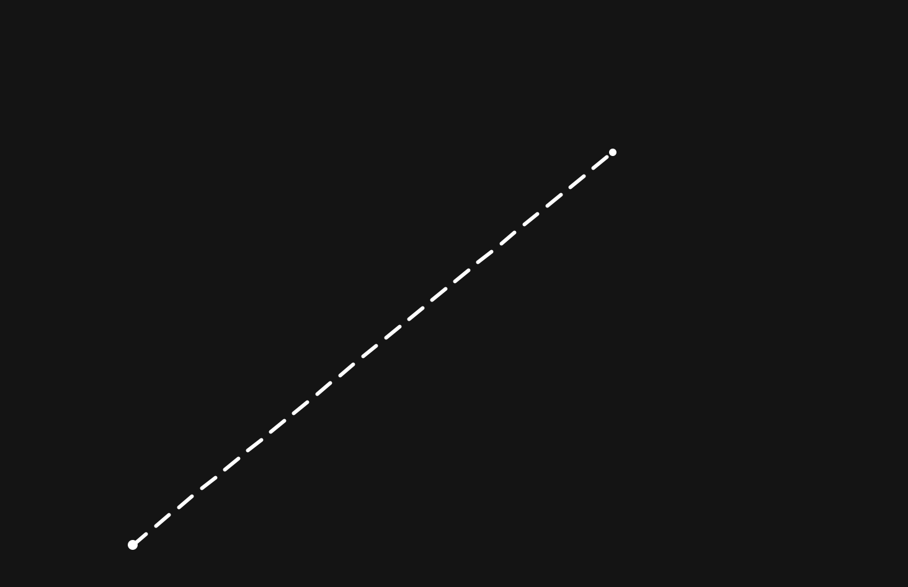

# Day 2: For Loops

## Topics
- `for` loop syntax: initialization, condition, update
- Converting while loops to for loops
- When to use for vs while
- Using the loop variable `i` for counting
- Using `map()` to scale loop variable to visual ranges
- Drawing grids with nested for loops (introduction)

---

## Level 1
**Concentric Rings** - Use a for loop to draw concentric circles (largest first, smallest last). Vary the color of each ring. Make the center follow the mouse.

## Level 2
**String Art** - Use a for loop to draw lines between points on two different edges of the canvas, creating a string-art curve effect. Experiment with spacing and connection patterns.

## Level 3
**Dashed Line** - Write a for loop that draws a dashed line from one point to the mouse cursor. Each dash has a fixed length with a gap between. Longer distances = more dashes.

