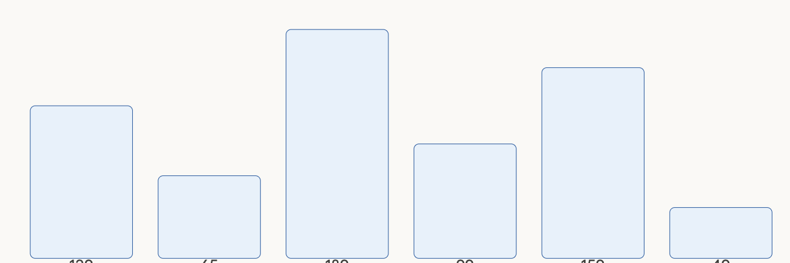
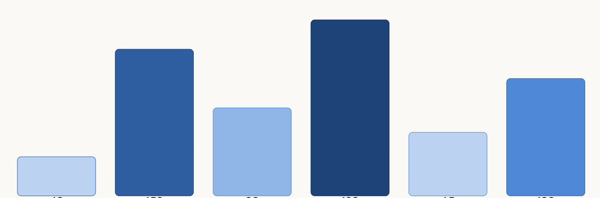

# Day 1: Introduction to Arrays

## Topics
- What is an array and why do we need one?
- Declaring and initializing arrays with values
- Accessing elements by index (0-based)
- `.length` property
- Looping through an array

---

## Exercise 1: Row of Bars
Create an array of 6 numbers (pick any values between 20 and 200). Use a `for` loop to draw one rectangle per value across the canvas. Each rectangle's height comes from the array.

## Exercise 2: Reordering Rectangles

Start with your bars from Exercise 1. Now draw them in **reverse order** — last element first — without changing the original array. Use `map()` to color each bar by its height. If you want more of a challenge, try sorting the bars from shortest to tallest before drawing.

## Exercies 3: Extend Bouncing Balls
Create a new version of your bouncing ball sketch with multiple balls. Loop through arrays of xPositions, yPositions, xSpeeds, and ySpeeds to make the balls move and bounce off the walls.