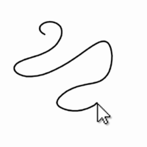

# Day 2: Arrays and Loops

## Topics
- Creating arrays with a set size (`new float[100]`)
- Shifting data through an array each frame
- Using arrays to store a history of values

---

## Exercise 1: Dot Echo
Create an array of 10 floats. Each frame, shift all values down one index and store `mouseX` at position 0. Draw a circle at each stored x-position (all at the same y). You should see 10 dots trailing your mouse horizontally.

## Exercise 2: Living Line
*Inspired by Code as Creative Medium (p. 160)*

Store the last 50 mouse positions using two arrays (one for x, one for y). Instead of drawing circles, draw **lines between consecutive points** to create a continuous polyline that follows your cursor. Use `map()` on the index so newer segments are brighter and older ones fade out. If you want more of a challenge, make the stroke thickness change based on how fast the mouse is moving — use `dist()` between consecutive points to measure speed. Fast = thin, slow = thick, like a calligraphy pen.

