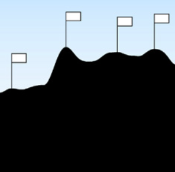

# Day 3: Searching Arrays

## Topics
- Looping through an array to find a value (min, max)
- Comparing array elements
- Using arrays to represent data visually

---

## Exercise 1: Find the Max
Create an array of 8 random numbers (use `random()` in `setup()`). Draw a circle for each value. Loop through the array to find the largest value and highlight that circle in a different color.

## Exercise 2: Plant the Flag

Create an array of 20+ random height values. Draw them as vertical bars side by side to make a terrain silhouette. Find the tallest bar and plant a flag on it (a line + small triangle). If you want more of a challenge, find *all* the peaks — any bar taller than both its neighbors — and mark each one.

