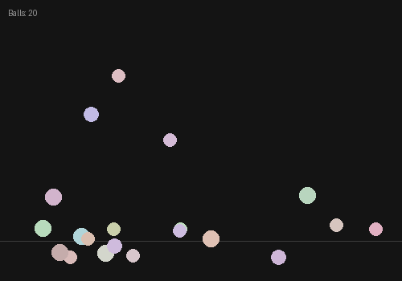
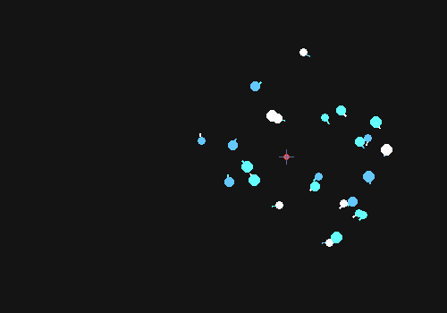

# Day 4: Introduction to ArrayLists — Forces

## Topics
- Why ArrayLists? Arrays have a fixed size — ArrayLists grow and shrink as your program runs
- Creating an ArrayList: `ArrayList<Float> myList = new ArrayList<Float>();`
- Adding: `.add()`, Reading: `.get()`, Updating: `.set()`, Counting: `.size()`
- Removing: `.remove(index)` and why you must loop **backward** when removing
- Looping through an ArrayList with a `for` loop

---

## Why This Matters

With arrays, you had to decide how many things you needed before your program even started. But the most interesting programs — simulations, games, particle systems — create things on the fly. A user clicks and a ball appears. A volcano erupts and a hundred rocks fly out. You have no idea how many objects you'll need.

**ArrayLists solve this.** They grow when you `.add()` and shrink when you `.remove()`. Today we'll use them to build a physics simulation where every click adds a new object to the world.

| | Array | ArrayList |
|---|---|---|
| Size | Fixed forever | Grows and shrinks |
| Create | `float[] x = new float[10];` | `ArrayList<Float> x = new ArrayList<Float>();` |
| Add | Can't — size is locked | `x.add(value);` |
| Read | `x[i]` | `x.get(i)` |
| Update | `x[i] = value;` | `x.set(i, value);` |
| Remove | Can't | `x.remove(index);` |
| Count | `x.length` | `x.size()` |

---

## The Backward Loop

When you remove element `i` from an ArrayList, everything after it shifts down by one. If you loop forward, the next element gets skipped. **Always loop backward when removing:**

```java
for (int i = list.size() - 1; i >= 0; i--) {
  // update, draw, and check if it should die
  if (shouldRemove) {
    list.remove(i);
  }
}
```

---

## Exercise 1: Gravity Drops

*Inspired by Daniel Shiffman's Nature of Code — forces and movers*

Click anywhere to release a ball. It falls under gravity, bounces off the floor, and gradually loses energy until it settles. Each click adds another ball to the world. The screen fills with a little physics playground you created.

**Your sketch should:**
1. Create three `ArrayList<Float>` — one for x positions, one for y positions, one for y-velocity
2. In `mousePressed()`, add the mouse position and a starting velocity of 0
3. Each frame, for every ball:
   - Add a small gravity value (like 0.4) to its y-velocity
   - Add its y-velocity to its y-position
   - If it hits the floor (`y > height`), bounce it: set y to height, and reverse its velocity with some energy loss (multiply by -0.8)
4. Draw every ball and display the count



**Make it yours:** Give each ball a random size (add a fourth ArrayList). Add walls on the left and right edges. Try different gravity values — what does 0.1 feel like? What about 2.0? What happens on the moon (gravity = 0.07)?

---

## Exercise 2: Attract

*Inspired by Nature of Code Chapter 2 — gravitational attraction*

Build on your Gravity Drops. Now the mouse is a gravitational attractor — every ball is gently pulled toward the cursor each frame, in addition to falling with gravity. The result: balls orbit, swirl, and cluster around your mouse in fluid, hypnotic motion.

**Build on Exercise 1 by adding:**
1. Each frame, for every ball, calculate the direction from the ball toward the mouse
2. Add a small fraction of that direction to the ball's velocity (this is the "attraction force")
3. You'll need a fourth ArrayList for x-velocity (so balls can move horizontally too)

Here's the core idea — for each ball, add these two lines inside your loop:
```java
float forceX = (mouseX - x.get(i)) * 0.01;
float forceY = (mouseY - y.get(i)) * 0.01;
```
Then add `forceX` and `forceY` to the ball's velocities. That `0.01` controls how strong the pull is.



**Make it yours:** Try pressing the mouse to make the attractor push balls away instead of pulling them (flip the sign). What value of attraction strength creates the most interesting orbits? Can you add "friction" so balls slowly lose speed over time? Press a key to freeze/unfreeze the attractor. What happens if you remove gravity entirely and only have the attractor?
